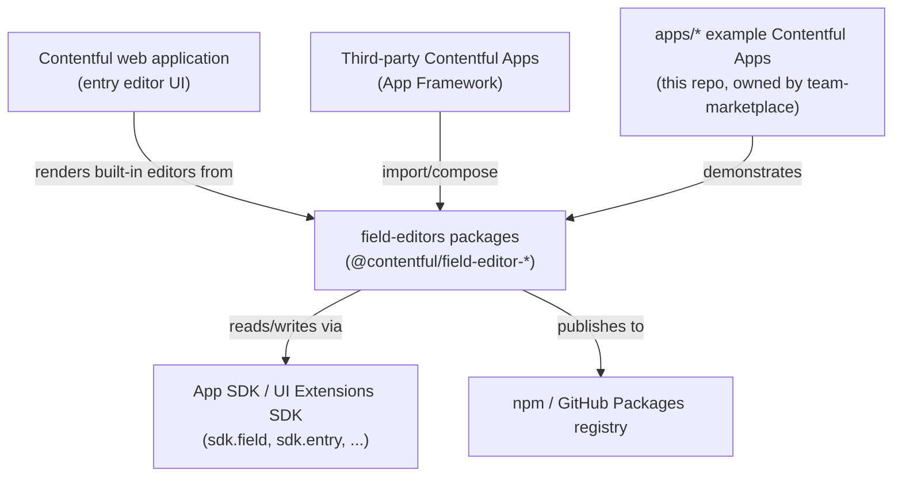

# Architecture

## 1. Overview

`field-editors` is a monorepo of React components implementing Contentful's built-in entry-field editors (single line text, rich text, references, date, JSON, etc.), published individually to npm as `@contentful/field-editor-*` packages (`packages/*/package.json`, e.g. `@contentful/field-editor-single-line`). It is a **source-and-package library**, not a deployed service: there is no server, no database, and no runtime process of its own — its output is npm packages consumed by other applications.

## 2. System Context

The diagram below is `[INFERRED]` from code (`packages/*/package.json` dependencies on `@contentful/app-sdk`-shaped types) and from this repo's own README/docs.

- **Upstream consumers:** Contentful's main web application renders these components as the default editor for each field type (stated in `README.md`: "This repository has all editorial components that you can find in the Contentful Web application"). Third-party Contentful Apps can also import individual packages directly.
- **Downstream/integration boundary:** every editor package receives an SDK-shaped `field`/`entry`/`locales` object (see `packages/_shared/src/types.ts`, consumed via `FieldConnector` in `packages/_shared/src/FieldConnector.ts`) — the App SDK contract is the integration seam. This repo implements the editor UI; it does not implement or own the SDK contract itself.
- **Publishing target:** packages publish to `https://npm.pkg.github.com/` per `publishConfig.registry` in every package's `package.json`, plus a public canary channel (see § Operational Knowledge → Release).

## 3. Internal Structure

Two top-level directories, under **different CODEOWNERS** (`.github/CODEOWNERS`):

| Directory   | Owner                                               | Purpose                                                                                                                                                                                                                              |
| ----------- | --------------------------------------------------- | ------------------------------------------------------------------------------------------------------------------------------------------------------------------------------------------------------------------------------------ |
| `packages/` | `@contentful/team-content-authoring-and-publishing` | The field editor packages themselves, plus shared internals (`_shared`, `_test`).                                                                                                                                                    |
| `apps/`     | `@contentful/team-marketplace`                      | Example/demo Contentful Apps (built with `create-contentful-app`) showing how to embed individual field editor packages inside a custom App.                                                                                         |
| `cypress/`  | `@contentful/team-content-authoring-and-publishing` | Cypress component tests.                                                                                                                                                                                                             |
| `tools/`    | (not declared in CODEOWNERS)                        | Build/lint helper scripts, e.g. `tools/extract-new-translation-keys/`, a custom ESLint plugin/rule for Lingui key naming (`tools/eslint-plugin-custom-lingui`, referenced from root `package.json` devDependencies as a local path). |

### `packages/` breakdown

Each package builds three output targets (`dist/cjs`, `dist/esm`, `dist/types`) via SWC + `tsc`, and follows the same `src/<Name>Editor.tsx` + `index.tsx` + `<Name>Editor.spec.tsx` shape.

| Package                 | npm name                                     | Purpose                                                                                                                                                                                                                                                                                                                                               |
| ----------------------- | -------------------------------------------- | ----------------------------------------------------------------------------------------------------------------------------------------------------------------------------------------------------------------------------------------------------------------------------------------------------------------------------------------------------- |
| `_shared`               | `@contentful/field-editor-shared`            | Shared internals used by every other package: `FieldConnector` (subscribes to field/locale/entry changes), `queryClient`/`react-query` setup, entity helpers, release-status and locale-publishing-status badge components.                                                                                                                           |
| `_test`                 | `@contentful/field-editor-test-utils`        | Shared test doubles: `createFakeFieldAPI`, `createFakeSpaceAPI`, `createFakeLocalesAPI`, `createFakeCMAAdapter`, `createFakeNavigatorAPI`, a test query-client factory, and `ActionsPlayground` (Storybook helper). **Note:** its `README.md` currently has the wrong title/description (copy-pasted from `_shared`)                                  |
| `boolean`               | `@contentful/field-editor-boolean`           | Boolean field editor.                                                                                                                                                                                                                                                                                                                                 |
| `checkbox`              | `@contentful/field-editor-checkbox`          | Checkbox-group field editor.                                                                                                                                                                                                                                                                                                                          |
| `date`                  | `@contentful/field-editor-date`              | Date (and optional time/timezone) field editor.                                                                                                                                                                                                                                                                                                       |
| `default-field-editors` | `@contentful/default-field-editors`          | Composite package: given a field/widget type, renders the matching built-in editor with the same structure/styling as the Contentful web app (`Field`, `FieldWrapper` components).                                                                                                                                                                    |
| `dropdown`              | `@contentful/field-editor-dropdown`          | Dropdown/select field editor.                                                                                                                                                                                                                                                                                                                         |
| `json`                  | `@contentful/field-editor-json`              | JSON object field editor.                                                                                                                                                                                                                                                                                                                             |
| `list`                  | `@contentful/field-editor-list`              | List-of-strings field editor (`ListEditor`, built on `TextInput` + `FieldConnector`).                                                                                                                                                                                                                                                                 |
| `location`              | `@contentful/field-editor-location`          | Location field editor (lat/lng via Google Maps API).                                                                                                                                                                                                                                                                                                  |
| `markdown`              | `@contentful/field-editor-markdown`          | Markdown field editor.                                                                                                                                                                                                                                                                                                                                |
| `multiple-line`         | `@contentful/field-editor-multiple-line`     | Multi-line text editor.                                                                                                                                                                                                                                                                                                                               |
| `number`                | `@contentful/field-editor-number`            | Number field editor.                                                                                                                                                                                                                                                                                                                                  |
| `radio`                 | `@contentful/field-editor-radio`             | Radio-button-group field editor.                                                                                                                                                                                                                                                                                                                      |
| `rating`                | `@contentful/field-editor-rating`            | Rating field editor.                                                                                                                                                                                                                                                                                                                                  |
| `reference`             | `@contentful/field-editor-reference`         | Entry/Asset reference field editor (single & multiple references, media).                                                                                                                                                                                                                                                                             |
| `rich-text`             | `@contentful/field-editor-rich-text`         | Production Rich Text editor (Slate-based; see package README for the v2/Slate migration notes).                                                                                                                                                                                                                                                       |
| `rich-text-alpha`       | `@contentful/field-editor-rich-text-alpha`   | **Experimental** next-generation Rich Text editor (ProseMirror-based). README states explicitly: "not production-grade," "Contentful doesn't provide any form of support for it," "may be removed... without notice," and "not available on npm." `[POSSIBLY LEGACY/UNSTABLE BY DESIGN — not a stability regression, this is declared experimental]`. |
| `single-line`           | `@contentful/field-editor-single-line`       | Single-line text editor.                                                                                                                                                                                                                                                                                                                              |
| `slug`                  | `@contentful/field-editor-slug`              | Slug field editor (auto-generates URL-safe slugs; supports a document-level auto-generation opt-out per recent history).                                                                                                                                                                                                                              |
| `tags`                  | `@contentful/field-editor-tags`              | Tags field editor.                                                                                                                                                                                                                                                                                                                                    |
| `url`                   | `@contentful/field-editor-url`               | URL field editor.                                                                                                                                                                                                                                                                                                                                     |
| `validation-errors`     | `@contentful/field-editor-validation-errors` | Shared `ValidationErrors` display component, used to render field validation errors consistently.                                                                                                                                                                                                                                                     |

**Entity completeness check (Step 6 inline verification gate):** 23 directories exist under `packages/` (21 field-editor/utility packages + `_shared` + `_test`); all 23 are listed above. `packages/shared` (no file extension, not a directory) and `packages/Contributing.mdx` / `packages/Introduction.mdx` are Storybook doc pages, not packages, and are excluded from this table by design (see § Notable findings). Delta: 0.

### `apps/` breakdown (example apps, not published packages)

| App                       | Purpose                                                                                                                                                                                                                                                                                                       |
| ------------------------- | ------------------------------------------------------------------------------------------------------------------------------------------------------------------------------------------------------------------------------------------------------------------------------------------------------------- |
| `entry-app-collapsible`   | Example custom Entry Editor app.                                                                                                                                                                                                                                                                              |
| `markdown-app`            | Example custom App embedding `@contentful/field-editor-markdown`.                                                                                                                                                                                                                                             |
| `multiple-references-app` | Example custom App embedding the reference editor for multiple references.                                                                                                                                                                                                                                    |
| `rich-text-app`           | Example custom App embedding `@contentful/field-editor-rich-text`.                                                                                                                                                                                                                                            |
| `singleline-app`          | Example custom App embedding `@contentful/field-editor-single-line`. **Pins old dependency versions** (`@contentful/f36-components@^5.4.1`, `@contentful/field-editor-single-line@^0.15.6`) relative to the current package versions — `[POSSIBLY LEGACY — no active-maintenance evidence found for apps/*]`. |

## 4. Data Flow

**Editor render/edit flow** (traced statically: `packages/_shared/src/FieldConnector.ts` → any `<Name>Editor.tsx`):

1. A host (Contentful web app or a custom App) constructs an SDK-shaped `field`/`locales` object and passes it as a prop into an editor component, e.g. `<SingleLineEditor field={sdk.field} isInitiallyDisabled={...} />`.
2. The editor component wraps its rendering in `FieldConnector` (`packages/_shared/src/FieldConnector.ts`), which subscribes to `field.onValueChanged` / `field.onIsDisabledChanged` (SDK event API) and re-renders with the current value, disabled state, and any validation errors.
3. User input triggers the editor's local `onChange`, which calls `field.setValue(...)` on the SDK object — the host application (not this repo) is responsible for persisting the change.
4. Validation errors surface through the shared `ValidationErrors` component (`packages/validation-errors`), driven by data the host SDK provides — this repo renders the errors, it does not compute them.

`[INFERRED]` — traced through `FieldConnector`'s public shape and one concrete consumer (`single-line`); not verified against every one of the 21 editor packages individually. Packages with materially different data flows (call out explicitly): `reference` (fetches linked entries/assets via a CMA adapter — see `packages/_shared/src/typesEntity.ts` and `EntityStore.tsx`), `rich-text`/`rich-text-alpha` (document-tree editing via Slate/ProseMirror, not a single scalar value).

**Build/publish flow** (traced from CI config, factual, not inferred):

1. Push/PR triggers `.circleci/config.yml` `commit` workflow: `lint`, `unit-tests`, `component-tests` run in parallel.
2. On any non-`master` branch (after `lint` + `unit-tests` pass): `prerelease` job runs `lerna publish --canary --preid canary --dist-tag canary`.
3. On `master` (after `lint` + `unit-tests` pass): `release` job runs `lerna version --conventional-commits --create-release github` then `lerna publish from-git` — this is what actually cuts a real npm release and a GitHub release.

## 5. Domain Concepts

- **Field Editor** — a React component that renders and edits one Contentful field type/widget. Each lives in its own `packages/<name>` package and is independently versioned/published. States: enabled/disabled (via SDK `isDisabled`), valid/invalid (via SDK validation errors), single-locale/multi-locale (via `locales` prop). Invariant: every editor consumes the SDK contract through `FieldConnector`, not a hand-rolled subscription — confirmed across `boolean`, `json`, `radio`, `reference`, `rich-text`, and `single-line` (every editor's top-level component imports `FieldConnector` from `@contentful/field-editor-shared`). `FieldConnector` is currently implemented as a class-component-shaped render-props API; an open refactor ([#2195](https://github.com/contentful/field-editors/pull/2195)) converts its internals to hooks while preserving the existing public component API, so treat the "wrap in `FieldConnector`" convention as stable even as its internal implementation changes.
- **Default Field Editors** (`packages/default-field-editors`) — a routing layer that maps a Contentful field/widget type to the correct built-in editor package, matching the web app's own structure/styling. This is the closest thing to a single "entry point" for consuming "all the editors at once."
- **Canary release** — a temporary, non-production npm publish (`<version>-canary.<pr>.<sha>`, `canary` dist-tag) cut automatically on non-master branches once lint/tests pass. Not for pinning in production. See `docs/ADRs/` (internal-only) for the decision history.
- **Experimental vs. production editor** — `rich-text` is the production Rich Text editor; `rich-text-alpha` is an explicitly unsupported, unpublished-to-npm, may-be-removed-without-notice experimental replacement. Do not treat the two as interchangeable or `-alpha` as simply "a newer version."

## 6. Key Dependencies

| Dependency                                                                                 | How it's used                                                                                                                                                                                                                                                                                                                  | What happens if unavailable                                                                                                                                                                                                                                                                                                                                                                                                                                                                                                                                                                                                                                                                                                           |
| ------------------------------------------------------------------------------------------ | ------------------------------------------------------------------------------------------------------------------------------------------------------------------------------------------------------------------------------------------------------------------------------------------------------------------------------ | ------------------------------------------------------------------------------------------------------------------------------------------------------------------------------------------------------------------------------------------------------------------------------------------------------------------------------------------------------------------------------------------------------------------------------------------------------------------------------------------------------------------------------------------------------------------------------------------------------------------------------------------------------------------------------------------------------------------------------------- |
| `@contentful/f36-components` / `@contentful/f36-tokens` (Forma 36)                         | Contentful's design system — every editor's UI is built from these components. Pinned to `^6.7.1` across all `packages/*` (root `resolutions` also pins `@types/react`).                                                                                                                                                       | Hard dependency — editors cannot render without it (compile-time import, not a runtime-optional integration).                                                                                                                                                                                                                                                                                                                                                                                                                                                                                                                                                                                                                         |
| App SDK-shaped `field`/`locales`/`entry` objects                                           | Every editor is constructed with these as props; `FieldConnector` subscribes to their change events. The App SDK package itself is not a `packages/*` dependency — the _shape_ is defined locally in `packages/_shared/src/types.ts` and satisfied at runtime by whatever host (web app or `@contentful/app-sdk`) provides it. | Hard dependency for rendering — no SDK object means no field to connect to. Not a network call; this is a prop-shape contract, not a live service call.                                                                                                                                                                                                                                                                                                                                                                                                                                                                                                                                                                               |
| `@lingui/core` / `@lingui/react`                                                           | i18n runtime; peer dependency of every package. Consuming apps must call `i18n.setMessagesCompiler(compileMessage)` and `i18n.activate(<locale>)` before rendering (documented in root `README.md` § Internationalization).                                                                                                    | **Hard failure, not graceful degradation.** If a consuming app never activates a Lingui locale, affected components throw on render rather than falling back silently — reported against this repo directly in [contentful/field-editors#1914](https://github.com/contentful/field-editors/issues/1914) ("Lingui initialization failed in MultipleEntryReferenceEditor"). Consumers must call `i18n.activate(<locale>)` (an empty catalog is sufficient — default messages are inlined in the components) before rendering any field editor.                                                                                                                                                                                          |
| `react-query` (`@tanstack/react-query`, wrapped by `packages/_shared/src/queryClient.tsx`) | Used by editors that fetch data client-side (e.g., `reference`, content-type lookups via `useContentTypes`). `packages/_shared/src/queryClient.tsx` detects react-query v4 vs v5 at runtime via `setLogger` (commit `55bfdfdb`, "fix(shared): queryClient detects react-query v4/v5 using setLogger").                         | **Hard failure on major-version mismatch.** `field-editor-reference` depends on react-query v4 directly while `field-editor-shared`/`field-editor-rich-text` accept v4 or v5; if a consumer's bundler hoists a single react-query major that doesn't match what a given package expects, affected components can crash at render time on loading-status handling. Fixed for one such mismatch in this repo's own history via commit `060cdf6` / [#2185](https://github.com/contentful/field-editors/issues/2185) ("normalize react-query v5 loading status across field editors"). Treat any react-query major-version bump in a consuming app as something to test against every embedded field editor, not just the app's own code. |
| npm / GitHub Packages registry (`npm.pkg.github.com`)                                      | Publish target for every package (`publishConfig.registry` in every `packages/*/package.json`).                                                                                                                                                                                                                                | Hard dependency for the release CI jobs (`release`, `prerelease`) — publish fails if unreachable or auth token (`GITHUB_PACKAGES_WRITE_TOKEN`, fetched via the `vault` CircleCI orb) is invalid. Does not affect already-published packages or local development.                                                                                                                                                                                                                                                                                                                                                                                                                                                                     |

## 7. Configuration

No application runtime environment variables were found — this is a component library, not a running service, so most "configuration" is build/CI-time, not runtime.

| Variable / Flag                                                         | Purpose                                                                                                                                                                                                                                  | Default                                                                                                                                                                                                                                                                                                                                                                                                                                          |
| ----------------------------------------------------------------------- | ---------------------------------------------------------------------------------------------------------------------------------------------------------------------------------------------------------------------------------------- | ------------------------------------------------------------------------------------------------------------------------------------------------------------------------------------------------------------------------------------------------------------------------------------------------------------------------------------------------------------------------------------------------------------------------------------------------ |
| `CYPRESS_INSTALL_BINARY=0`                                              | CircleCI `linux-node` executor env — skips downloading the Cypress binary on jobs that don't need it.                                                                                                                                    | Set in `.circleci/config.yml` executor definition.                                                                                                                                                                                                                                                                                                                                                                                               |
| `TZ=UTC`                                                                | Set at the `linux-cypress` executor level and again inside `packages/rich-text/vitest.config.ts` and `packages/reference/vitest.config.ts` — pins timezone for deterministic date/time test assertions.                                  | `UTC`, test/CI-only.                                                                                                                                                                                                                                                                                                                                                                                                                             |
| `GITHUB_PACKAGES_READ_TOKEN` / `GITHUB_PACKAGES_WRITE_TOKEN`            | Written into a job-local `.npmrc` to authenticate against the private `@contentful` scope on `npm.pkg.github.com`, for component-test/release/prerelease CI jobs respectively. Sourced from the `vault` CircleCI orb, not a repo secret. | CI-only.                                                                                                                                                                                                                                                                                                                                                                                                                                         |
| `CONTENTFUL_ORG_ID`, `CONTENTFUL_APP_DEF_ID`, `CONTENTFUL_ACCESS_TOKEN` | Referenced by `apps/*` example apps' `upload-ci` script (`contentful-app-scripts upload --ci`) — not consumed by any `packages/*` code.                                                                                                  | `[POSSIBLY DEAD CONFIG — declared but no CI consumer found]`. Confirmed by reading the full `.circleci/config.yml`: none of its five jobs (`lint`, `unit-tests`, `component-tests`, `release`, `prerelease`) build, test, or invoke this script for anything under `apps/*`. `apps/*` has no CI coverage of any kind in this repo today — consistent with the § Internal Structure finding that `apps/*` examples pin stale dependency versions. |

## 8. Operational Knowledge

This repo ships npm packages; it does not run a deployed service. Standard Operational Knowledge subsections don't apply in the usual sense.
