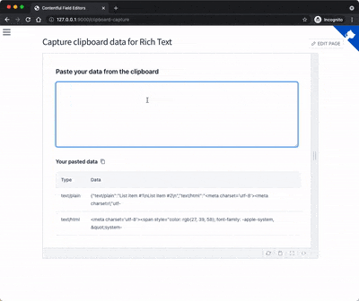
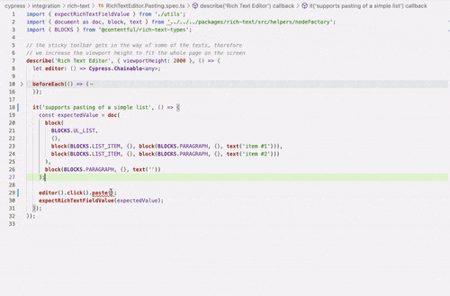

# Rich Text integration tests

## How to add tests for pasting

### Grab the clipboard data

Because pasting (or drag & drop) is a matter of working with the [DataTransfer object](https://developer.mozilla.org/en-US/docs/Web/API/DataTransfer) of the HTML5 Clipboard API
you need get your hands on the underlying data. To make this easy, there is a page in Docz to help you with that. Simply:

1. Execute `yarn docz:dev` locally
2. Navigate to http://127.0.0.1:9000/clipboard-capture.
3. Paste what you have into the textarea
4. Click on the copy button next to the "Your pasted data" heading, all the data from the table will be copied as JSON to your clipboard

### Pasting the necessary data into your test

You are all set now, last things to do:

1. Go to your Cypress test
2. Select an element, focus it and run the paste command, e.g. `editor().click().paste()`
3. Paste the JSON from your clipboard as argument of the `.paste()` command
4. Cleanup and anonymize the data if necessary

