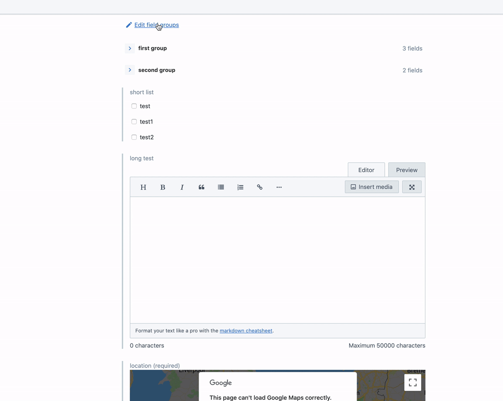

# Entry editor app with collapsible groups

This app demonstrates how you would use all existing field editors to create a complex entry editor app.

## Setting up the app

In order to you see your app running in the Contentful web app, you need to create an `AppDefinition` to expose the app to Contentful. You can run the following command to create an `AppDefinition`:

`npx @contentful/create-contentful-app create-definition`

During the setup, you will be able to choose where the app will be displayed. This app is designed to replace the Entry Editor, so we recommend selecting `Entry editor` and nothing else during the setup.

If you play to extend your app to be displayed in other locations, feel free to select those too. You can always change this in your organization settings within Contentful.

## Commands

This packages uses [create-contentful-app](https://github.com/contentful/create-contentful-app).

### `yarn start`

Starts the development server and builds the app in development mode.

The app will automatically reload if you make changes to the code.

### `yarn build`

Builds the app for production to the build folder.
It correctly bundles React and all dependencies in production mode and optimizes the build for the best performance.
